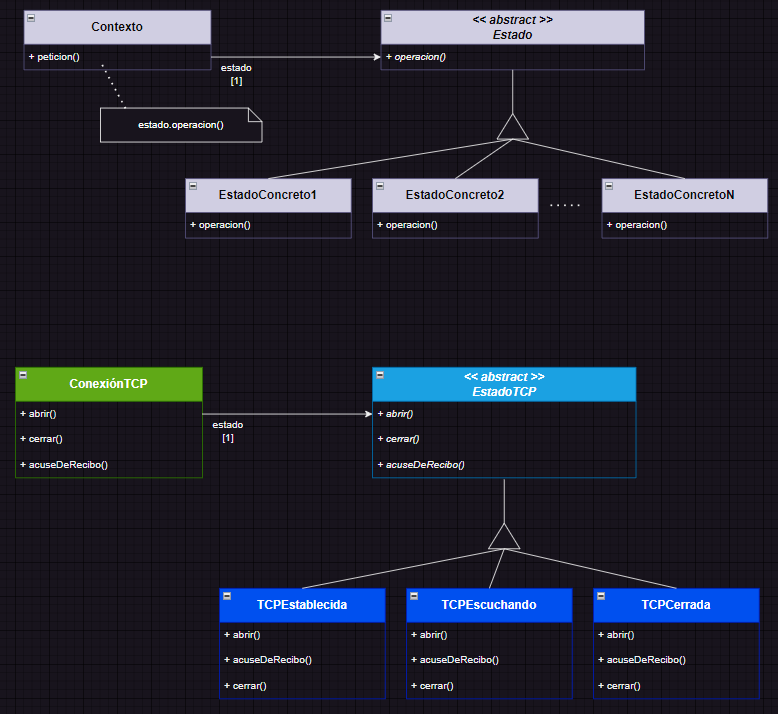

## Estados como objetos (State)

### Descripción
	Patrón de comportamiento (de objetos).
	Este patrón permite que un objeto modifique su comportamiento dinámicamente, cada vez que cambie su estado interno. Parecerá que ha cambiado la clase misma del objeto.

### Funcionalidad
	La clave de este patrón es la abstracción de las lógicas dependientes de su estado hacia una clase abstracta que representa el estado actual y agrupa una interfaz común para cualquier estado.
	Mediante delegación, todas las operaciones dependientes del estado se delegan a una clase concreta específica que lo representa y gestiona. Cada vez que deba cambiar el estado, se reasignará una clase concreta diferente, en consecuencia.

### Propósito
	Evitar sentencias condicionales que dependen del estado del objeto y elevada extensión en el código, lo que impacta en la mantenibilidad y legibilidad del mismo.
	Ocultamiento de la lógica interna del seteo del estado intrínseco y su gestión, por parte de la clase que lo representa sin exposición al contexto.

### Estructura
()

### Aplicailidad
	> El comportamiento de un objeto depende de su estado y debe cambiar en ejecución (dinámicamente).
	> Sentencias condicionales dependientes del estado del objeto, cada rama del condicional para cada estado.
	> Lógica interna del estado del objeto administrable o expueta en el contexto de la aplicación.

### Ventajas
	> Evitar sentencias del tipo switch extensas.
	> Mayor legibilidad y mantenibilidad del código.
	> Abstracción y ocultamiento de la gestión de estados internos.
	> Extensibilidad y elevada escalabilidad para futuros estados.

### Desventajas
	> Evaluación de la asiduidad de creación y eliminación de estados.
	> Evaluación de la posibilidad de reutilización de estados (flyweight).
	> Evaluación y decisión sobre la gestión de transición de estados.

### Aspectos a considerar
	> ¿pueden reutilizarse los estados entre diferentes objetos?
	> ¿estado inicial por defecto? ¿configurable externamente?
	> ¿quién y cuándo se debería gestionar la transición de estados? ¿se requieren estructuras adicionales?
	> ¿deben los estados poder ser configurables por un cliente externo?

### Colaboraciones
	> Si es necesario el contexto puede pasarse por parámetro hacia el estado, para que éste lo conozca.
	> Los clientes pueden interactuar únicamente con el contexto sin necesidad de ocuparse de los pormenores referentes al estado.
	> El contexto o los estados concretos pueden determinar y gestionar la transición entre estados.

### Consecuencias
	> Escalabilidad, para estados nuevos y transiciones solo se requerirá añadir una clase estado concreta.
	> Elimina condiciones y código extenso monolítico.
	> Puede tener elevada disgregación de objetos (explosión de muchos estados).
	> Aumento de la legibilidad, extensibilidad, escalabilidad y mantenibilidad del código.
	> Ocultamiento del estado interno al contexto y los clientes.
	> Explicita las transiciones entre estados.
	> Posibilidad de compartir estados si está representado únicamente por su tipo, sin estado intrínseco, sólo comportamiento (patrón flyweight).

### Fuentes relacionadas
&emsp;
&emsp;
&emsp;