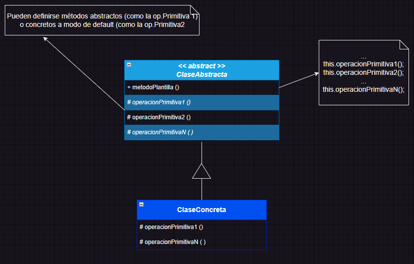

## Método plantilla (Template Method)

### Descripción
	Patrón de comportamiento (de clases).
	Este patrón permite definir una operación esqueleto como una secuenciación determinada de pasos en una clase abstracta, delegando en las subclases concretas la posibilidad de redefinir o extender uno o más de dichos pasos concretos, sin alterar la estructura común.

### Funcionalidad
	Reutilización de código y prevención de código duplicado. Refactorizando para generalizarlo mediante una definición de método abstracto con subetapas como métodos de enganche (hooks) que las subclases pueden redefinir para sobreescribir.
	Inversión de la lógica del flujo usual de control, las subclases no invocan a la superclase sino a la inversa, es decir, desde el método plantilla se invocará a los métodos de enganche de las subclases, principio "Hollywood, no nos llame, nosotros le llamamos".

### Propósito
	Proporcionar un método que permita a las diferentes subclases redefinir partes de la lógica general, mediante redefinición de ciertos métodos gancho (hooks).
	Evitar la duplicidad y repetición de código (métodos complejos) en las subclases.

### Estructura
()

### Aplicailidad
	> Se detecta una estructura algorítmica subyacente homogénea entre diferentes subclases con lógica repetida entre ellas.
	> Implementar partes de un algoritmo que no cambian, permitiendo que las subclases implmenten el comportamiento variable.
	> Cuando se tiene comportamiento repetido en varias subclases que debería refactorizarse para evitar duplicación.
	> Proporcionar un método esqueleto (plantilla) para la clase general.
	> Centralizar las partes de un método que se definirán en todas las subclases, pero pueden diferir levemente en su implementación.
	> Controlar las operaciones redefinibles por las subclases.
	> Muchos métodos de clases relacionadas, poseen una estructura similar. Pudiendo centralizarse y reutilizarse en la superclase.

### Ventajas
	> Facilita la reutilización del código.
	> Permite diferenciar la secuenciación lógica de pasos, de la implementación concreta.
	> Permite extensibilidad por herencia (de caja blanca), muy utilizada en frameworks.

### Desventajas
	> Puede ser tedioso a la hora de utilizarlo si la clase abstracta contiene muchos métodos abstractos.
	> Se recomienda que sea liviano, es decir, la clase abstracta invoque a pocos métodos abstractos.
	> Otra posibilidad es utilizar métodos por defecto en la clase abstracta, se le denominan métodos de anclaje.

### Aspectos a considerar
	> Considerar qué métodos ameritan ser abstractos o mantener una implementación por defecto en la clase abstracta.
	> Es importante especificar qué operaciones pueden redefinirse (enganches) y cuales deben redefinirse (abstractas).
		Puede utilizarse sintaxis especial para hacer clara referencia al método plantilla y a los de enganche.
		Ej: método plantilla -> prefijo "plantilla", ej: plantillaExtraccion()
			métodos que deben redefinirse (abstractos) -> prefijo "hacer", ej: hacerValidar()
			métodos de pueden redefinirse (ganchos) -> subfijo "gancho", ej: validarGancho()
	> Utilización del control de acceso:
		Evitar que el método plantilla se sobreescriba en las subclases. Operador Java final.
		Hacer que sean de acceso protegido los métodos gancho. Operador Java protected.
	> Minimización de operaciones primitivas (abstractas puras)
		Es recomendable implementar operaciones abstractas con implementación por defecto, reduciendo el número necesario de operaciones definibles en las subclases.

### Fuentes relacionadas
&emsp;
&emsp;
&emsp;